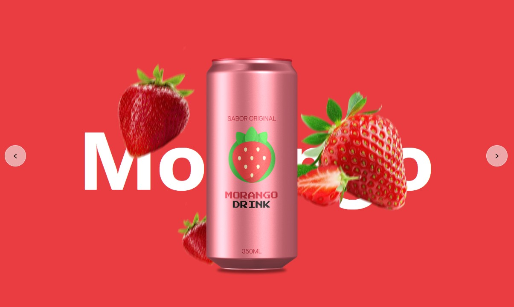

---
SUCO DEV 🍹

Um carrossel interativo de refrigerantes/frutas feito com HTML, CSS e JavaScript.
Permite navegar entre diferentes sabores com animações suaves e botões de navegação.

---
🖼️ Prévia

---
🎯 Funcionalidades

Navegação entre slides com os botões Anterior (<) e Próximo (>)

Transições animadas de entrada para título e imagem da fruta

Fundo colorido dinâmico para cada item via CSS custom properties (--background)

Layout responsivo e fácil de adaptar para novos itens

---
🛠️ Tecnologias utilizadas

HTML5 → Estrutura do carrossel

CSS3 → Estilização e animações

JavaScript (ES6+) → Controle de navegação entre slides
---

🚀 Como executar localmente

1 - Clone este repositório:
  -      git clone https://github.com/K4U4S4NT0S/PROJECT.git

2 - Entre na pasta do projeto:
  -      cd "REFRI DEV"   # ou o nome da pasta do projeto

3 - Abra o arquivo index.html no navegador.

---
📂 Estrutura de pastas:

REFRI DEV/
│-- index.html
│-- style.css
│-- scripts.js
│-- img/
│   │-- Morango-refrigerante.png
│   │-- Morango-refrigerante-foregroundBlur.png
│   │-- Abacate-refrigerante.png
│   │-- Abacate-refrigerante-foregroundBlur.png
│   │-- Laranja-refrigerante.png
│   │-- Laranja-refrigerante-foregroundBlur.png

---
🔮 Melhorias futuras

  -  Transição automática entre slides (slideshow)

  -  Adicionar mais sabores/frutas

  -  ornar 100% responsivo para dispositivos móveis

  - Efeitos extras de transição, como fade ou zoom

---
👨‍💻 Autor

Kauã Santos da Silva
---
